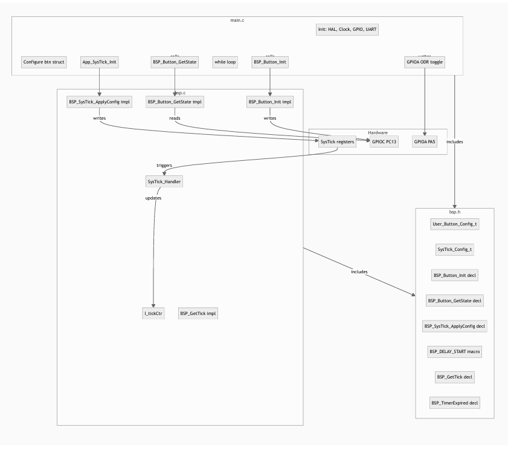
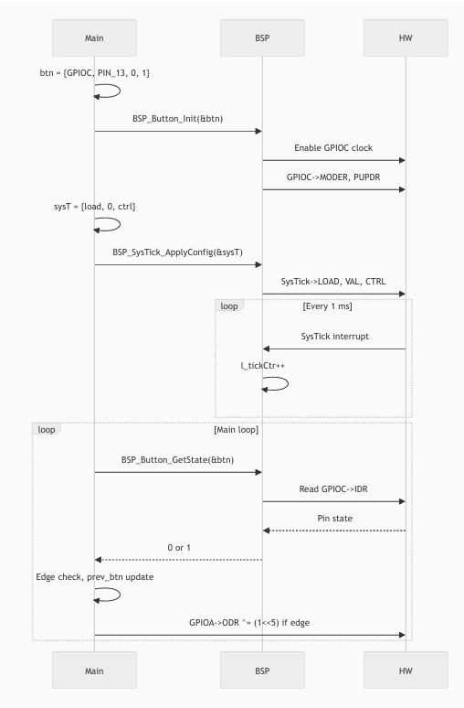

# STM32F4 – Button-controlled LED with custom BSP

A small embedded project for **STM32F4 Nucleo**: pressing the user button toggles the LED (latch behaviour). It uses a **Board Support Package (BSP)** so the main program only contains application logic and never touches hardware registers directly.

---

## What does this project do?

- **Hardware:** STM32F4 Nucleo (e.g. STM32F446RE).
- **Behaviour:** Each time you press the blue user button (B1), the green LED (LED2) toggles on or off and stays that way until the next press.
- **No continuous polling of the button for “hold”:** we only react on the **edge** (released → pressed), so one press = one toggle.

---

## Concepts for beginners

### 1. BSP (Board Support Package)

- **BSP** = layer of code that talks to the hardware (GPIO, SysTick, etc.).
- **Main application** = decides *what* should happen (e.g. “when button is pressed, toggle LED”) and calls BSP functions.
- **Rule we follow:** `main.c` does **not** write to registers like `MODER` or `PUPDR`; only the BSP does. So “handle hardware in BSP, application logic in main.”

### 2. Config structs (no magic numbers in BSP)

- For the **button**, we use a struct: which port (e.g. GPIOC), which pin (e.g. 13), mode (input), pull (pull-up).
- For **SysTick** (the 1 ms timer), we use another struct: reload value, initial value, control bits.
- **Main** fills these structs; **BSP** reads them and configures the hardware. So the BSP never hard-codes “PC13” or “PA5”; it always uses the config you pass.

### 3. GPIO config pattern

- Every GPIO-related config struct has **`GPIO_TypeDef *port` first**, then pin and options (mode, pull, etc.).
- The BSP uses that **one** `port` pointer to access all registers: `port->MODER`, `port->PUPDR`, `port->IDR`. So we don’t store “MODER value” in the struct; we store the *meaning* (e.g. mode 0 = input) and the BSP computes the right bits for that pin.

### 4. SysTick and delays

- **SysTick** is a 24‑bit timer that counts down and can generate an interrupt every 1 ms (when configured that way).
- In our **`bsp_config.c`** layer, the SysTick handler increments a counter `l_tickCtr`. From that we get:
  - **Blocking delay:** `BSP_Delay(ms)` – waits exactly `ms` milliseconds.
  - **Non-blocking delay:** `BSP_GetTick()` and `BSP_TimerExpired(target)` – main loop can do other work and only act when the timer has expired.

### 5. Latch behaviour (edge detection)

- We don’t care “button is held”; we care “button was just pressed.”
- So we compare **current** button state with **previous** state. Toggle the LED only when we see a transition from released (0) to pressed (1). That’s “edge detection” and gives one toggle per press (latch behaviour).

---

## BSP from ST (STM32CubeF4)

The Nucleo BSP used in this project comes from **ST’s official package**:

- **Package:** **STM32CubeF4** – STM32Cube MCU Package for STM32F4 series, version **1.28.0** (from the [ST official page](https://www.st.com/en/embedded-software/stm32cubef4.html)).
- **BSP location** (after unpacking the package):  
  `STM32Cube_FW_F4_V1.28.0\Drivers\BSP\STM32F4xx-Nucleo`  
  (e.g. on your PC: `D:\stm32cubef4-v1-28-0\STM32Cube_FW_F4_V1.28.0\Drivers\BSP\STM32F4xx-Nucleo`).

**What to copy into your project:**

1. Copy **`stm32f4xx_nucleo.h`** and **`stm32f4xx_nucleo.c`** from that folder into your project.
2. Prefer creating a **`BSP`** folder in your project and placing both files there.

**STM32CubeIDE configuration:**

- **Include path** (so the compiler finds `stm32f4xx_nucleo.h`):  
  **Project** → **Properties** → **C/C++ General** → **Paths and Symbols** → **Includes** tab → **Add…** → **Directory** → choose your project’s **BSP** folder.
- **Source** (so `stm32f4xx_nucleo.c` is compiled):  
  **Project** → **Properties** → **C/C++ General** → **Paths and Symbols** → **Source Location** → add the **BSP** folder (or add `stm32f4xx_nucleo.c` to the build).  
  Alternatively, right‑click the project → **Add existing source** and add the `.c` file from the BSP folder.

**Note:** The default BSP from ST does **not** implement all the functions used in this project. In this repo, the BSP is **modularized**: ST’s Nucleo files provide the board-level drivers (LED, PB, shields); our **`bsp_config`** layer (see below) provides the button/SysTick config structs and timing helpers used by the application.

---

## Architecture and code structure (overview)

From the project documentation (exported from the BSP plan):

**Architecture overview** – main, BSP, and hardware:



**Code structures** – how the modules connect:




---

## Project structure (simplified)

```
├── README.md                    ← You are here
├── BSP/
│   ├── stm32f4xx_nucleo.h      ← ST Nucleo BSP: board drivers (LED, PB, shields)
│   ├── stm32f4xx_nucleo.c      ← ST Nucleo BSP: implementation
│   ├── bsp_config.h            ← Our BSP API: config structs, button, SysTick, delays
│   ├── bsp_config.c            ← Our BSP API: tick counter, BSP_Button_Init, BSP_SysTick_ApplyConfig, etc.
│   
│   
├── docs/
│   ├── architecture_overview.png   ← Architecture diagram (from BSP doc)
│   ├── code_structures.png         ← Code structure diagram
│   ├── Reference Manual (STM32F4)   ← ST reference manual
│   ├── Schematic                   ← Board schematic
│   └── Cortex-M4 Generic User Guide ← ARM Cortex-M4 user guide
├── Core/
│   ├── main.c
│   ├── main.h
│   └── ...
└── ...
```

The BSP is **modularized** into two parts:

- **`stm32f4xx_nucleo.c` / `.h`** – ST’s Nucleo BSP from STM32CubeF4 (board-specific drivers). Optionally extended with ST’s LED/PB helpers; custom button/SysTick logic lives in `bsp_config` to avoid duplication.
- **`bsp_config.c` / `bsp_config.h`** – Our BSP API: `User_Button_config_t`, `SysTick_Config_t`, `BSP_Button_Init`, `BSP_Button_GetState`, `BSP_SysTick_ApplyConfig`, `BSP_Delay`, `BSP_GetTick`, `BSP_TimerExpired`, and the SysTick handler with tick counter. Main and init code use this layer.

- **`main.c`** – Application: **`BSP_Init()`** (one call that runs HAL, clock, GPIO, UART, configGpio, App_SysTick_Init, buttonConfig_Init, `__enable_irq`), then **`while(1)`** with button read and LED toggle on edge (super loop).

---

## How to build and run

1. Open the project in **STM32CubeIDE** (or your STM32 toolchain).
2. Build the project (e.g. Project → Build).
3. Connect the Nucleo board via USB, then Run/Debug.
4. Press the blue user button (B1); the green LED (LED2) should toggle on each press.

*(Exact steps may vary slightly with your Cube/IDE version.)*

---

## How it works (flow in simple words)

1. **Startup:** `main()` calls **`BSP_Init()`** once. That runs: HAL init, clock config, GPIO and UART init, `configGpio`, then our code (configure the button and call `BSP_Button_Init`; configure SysTick and call `BSP_SysTick_ApplyConfig` via `App_SysTick_Init`), then `__enable_irq`. So one function does all board and BSP setup.
2. **Every 1 ms:** SysTick interrupt runs (in `bsp_config.c`), increments `l_tickCtr` (and `HAL_IncTick` for HAL_Delay).
3. **Main loop (super loop):** Read button with `BSP_Button_GetState`. If we see “was released, now pressed”, toggle the LED (e.g. `GPIOA->ODR` for PA5). Store current button state for next iteration (for edge detection).

So: the BSP is split into ST’s Nucleo layer and our `bsp_config` layer; main only calls `BSP_Init()` then the super loop, and the BSP handles *how* the button and timer work.

---


### Docs folder (reference material)

The **`docs/`** folder in this repo contains:

- **`architecture_overview.png`** – Diagram of the project architecture (main, BSP, hardware).
- **`code_structures.png`** – Diagram of the code structures and how modules connect.
- **Reference manual** – STM32F4 Reference Manual (for register-level understanding).
- **Schematic** – Board schematic for the Nucleo used in this project.
- **Cortex-M4 Generic User Guide** – ARM document for the Cortex-M4 core.

Use these alongside the [Learning advice](#learning-advice) below when studying the project without relying on external tools.

---

## Learning advice

For a solid foundation in embedded, it helps to **avoid relying on AI or code generators at first**. Spend time with the **Reference Manual** (for your STM32) and the **Cortex-M4 Devices Generic User Guide** (ARM): read them, search for register names and behaviours, and try to understand *why* the code does what it does. Work as if no AI tool existed—look up addresses, bit fields, and sequences in the docs. Doing that for hours (and days) builds the same kind of understanding that made this project possible and will pay off in the long run.

---

## Summary

| Topic | What we did |
|-------|-------------|
| **BSP (modularized)** | **Two parts:** (1) ST’s `stm32f4xx_nucleo.c/.h` for board drivers; (2) our `bsp_config.c/.h` for button/SysTick config structs, tick counter, delays. Main only calls BSP functions. |
| **Init** | One entry point: **`BSP_Init()`** in `main.c` runs HAL, clock, GPIO, UART, configGpio, App_SysTick_Init, buttonConfig_Init, `__enable_irq`. Then `main()` is just `BSP_Init()` + super loop. |
| **Config** | Button and SysTick are configured via structs (`User_Button_config_t`, `SysTick_Config_t`); BSP uses them to set registers (no hard-coded pins in BSP). |
| **GPIO struct** | First field = `GPIO_TypeDef *port`; then pin and options; BSP uses `port` for every register. |
| **Delays** | SysTick (in `bsp_config.c`) drives a tick counter; we have blocking delay and non-blocking “timer expired” helpers. |
| **Button → LED** | Edge detection (released → pressed) so one press toggles the LED once (latch behaviour). |

If you are new to embedded or BSPs, start with this README, then open **BSP_code_documentation.md** or **BSP_plan_with_graphs.html** for the full picture.
